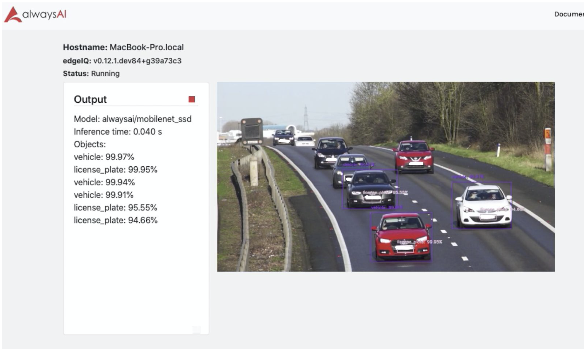

# License Plate Tracker App
This app uses object detection and employs a correlation tracker to monitor a frame for license plates and vehicles. Please note that the model used in this app does not detect the content or read the characters from a license plate. Pair this app with an OCR library to do so.

If you'd like to build your own license plate tracker from scratch, fill out this [survey](https://alwaysai.surveykiwi.com/model-training-signup) and download the ready made [dataset](https://www.alwaysai.co/docs/_static/beta/dataset_sample_592.zip) found here to begin training your own model. Then test out your model with your new app!



## Requirements
- [alwaysAI account](https://alwaysai.co/auth?register=true)
- [alwaysAI CLI tools](https://dashboard.alwaysai.co/docs/getting_started/development_computer_setup.html)

## Running
See [this page](https://alwaysai.co/docs/getting_started/working_with_projects.html) for documentation on setting up projects in the dashboard. See [this page](https://alwaysai.co/blog/building-and-deploying-apps-on-alwaysai) for details on building and running applications.

## Output
You should see output similar to the image shown here


## Troubleshooting
- If you are having trouble connecting to your edge device, use the CLI configure command to reset the device. Please see [this page](https://alwaysai.co/docs/reference/cli_commands.html) for more details.
- Make sure you are logged in to the CLI. Verify with ```aai user show``` and log in with ```aai user login``` if not. 

## Support
Docs: https://dashboard.alwaysai.co/docs/getting_started/introduction.html
Community Discord: https://discord.gg/rjDdRPT
Email: support@alwaysai.co


